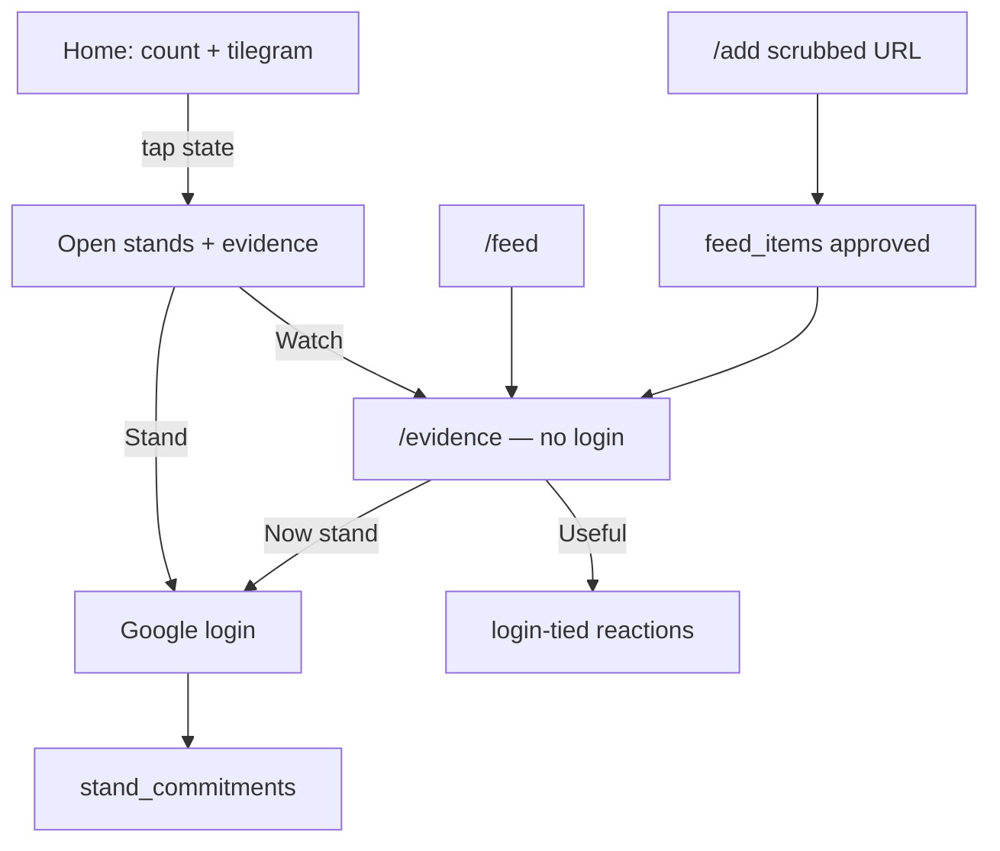

# Site flow — BharatBol

Account-linked stands; **public evidence** for everyone.

## Rules

1. **Evidence is public** — approved `feed_items` readable by anon; submitter only in sealed ledger.
2. **Only standing (and reactions) need login.**
3. **Counts are public** — security-definer aggregates after phase7.

See `docs/DEPLOY.md` for Auth Site URL / Google consent branding as BharatBol.
