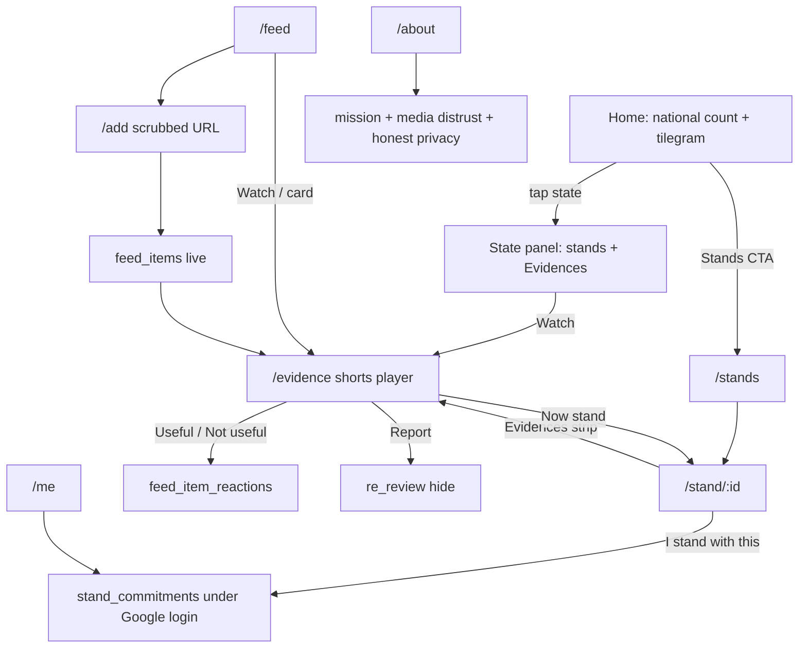

# Site flow — BharatBol

One map of how the product fits together (account-linked mode).

## Surfaces

1. **Home** — national counter, tilegram → state evidences + stands, link to `/evidence`.
2. **Stands / Stand detail** — stand (account-linked), Evidences for that issue, share, wall.
3. **Feed / Add / Evidence** — one clip corpus; add scrubbed public links; watch only in `/evidence`.
4. **Me** — profile, my stands, delete account (no ballot receipts).
5. **About / Data rights / Moderation** — trust story, media caveat, temporary auto-publish + report.

## Privacy mode (temporary)

Stands and reactions are tied to `auth.users`. Public UI still does not list who stood.
Blind-ballot restore path: see `docs/privacy-architecture.md` and comments in
`supabase/phase6_account_stands.sql`.
